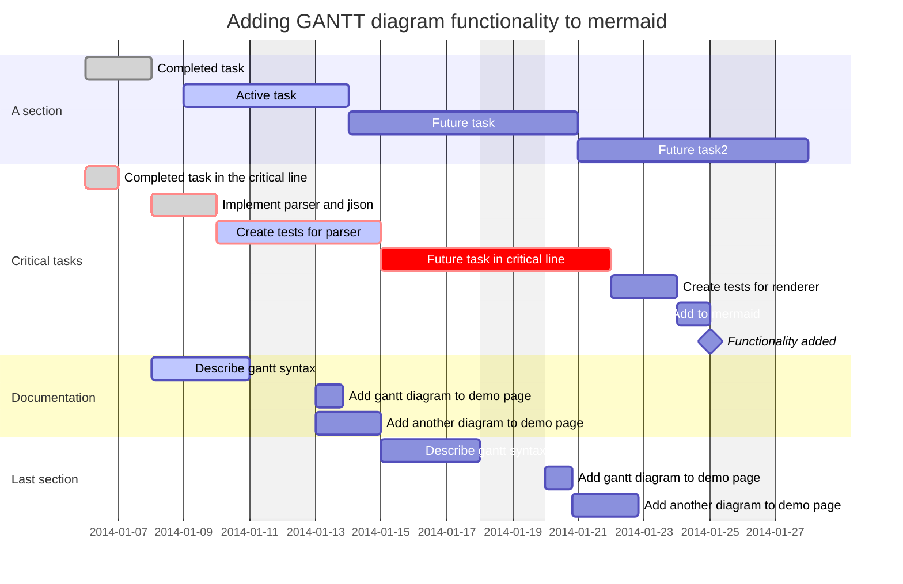

# diagrams
testing different diagram rendering diagrams in markdown


Here is a simple flow chart:

```mermaid
graph LR

subgraph Input
  In["User inputs a desired chemical to manufacture"]
end

subgraph Process
  style DCS fill:#ADD8E6, stroke:#000
  style KG1 fill:#ADD8E6, stroke:#000
  style Parts fill:#ADD8E6, stroke:#000
  style KG2 fill:#ADD8E6, stroke:#000
  style Met fill:#ADD8E6, stroke:#000
  style KG3 fill:#ADD8E6, stroke:#000

  DCS["Deep Chemical Space"]
  KG1["Possible Chemical Routes KG"]
  Parts["Manufacturing Partners"]
  KG2["Abstract Capabilities KG"]
  Met["Metrics for supply chain"]
  KG3["Possible Supply Chains KG"]

  DCS -->|CDI tools to identify routes| KG1
  KG1 -->|filter physically possible chemical routes (no explosive intermediaries etc.)| KG3
  Parts -->|Supplier capabilities added to KG.\\nShare data on molecular\\nstructures, manufacturing processes, etc.| KG2
  KG2 -->|Pair possible routes with routes\\navailable with capabilities / supply chains| KG3
  Met -->|add metrics on cost / \\nvulnerability etc. Asess and give weights| KG3
end

subgraph Output
  style Out fill:#ADD8E6, stroke:#000
  Out["User is presented with possible supply chains"]
end

In -->|User inputs| DCS
KG3 -->|Result| Out

```


<!---->
