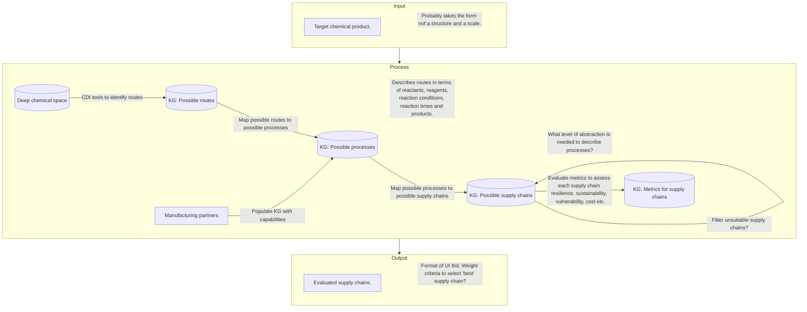

```mermaid

flowchart TD

    subgraph Input
    In["Target chemical product."]
    In ~~~ |"Probably takes the form nof a structure and a scale."|In
    end
    
    Input-->Process
    
    subgraph Process

    DCS[("Deep chemical space")]
    KGroutes[("KG: Possible routes")]
    Partners["Manufacturing partners"]
    KGprocesses[("KG: Possible processes")]
    KGsupplychains[("KG: Possible supply chains")]
    KGmetrics[("KG: Metrics for supply chains")]

    DCS -->|CDI tools to identify routes| KGroutes
    KGroutes -->|Filter unsuitable routes?| KGroutes
    KGroutes ~~~|" Describes routes in terms of reactants, reagents,\nreaction conditions, reaction times and products."|KGroutes
    Partners -->|Populate KG with capabilities| KGprocesses
    KGroutes -->|Map possible routes to possible processes| KGprocesses
    KGprocesses -->|Filter unsuitable processes?| KGprocesses
    KGprocesses ~~~|"What level of abstraction is needed to describe processes?"|KGprocesses
    KGprocesses -->|Map possible processes to possible supply chains| KGsupplychains
    KGsupplychains -->|Filter unsuitable supply chains?| KGsupplychains
    KGsupplychains -->|Evaluate metrics to assess each supply chain resilience, sustainability, vulnerability, cost etc| KGmetrics
    end

    subgraph Output
    Out["Evaluated supply chains."]
    Out~~~|"Format of UI tbd. Weight criteria to select 'best' supply chain?"|Out
    end

    Process-->Output
```
